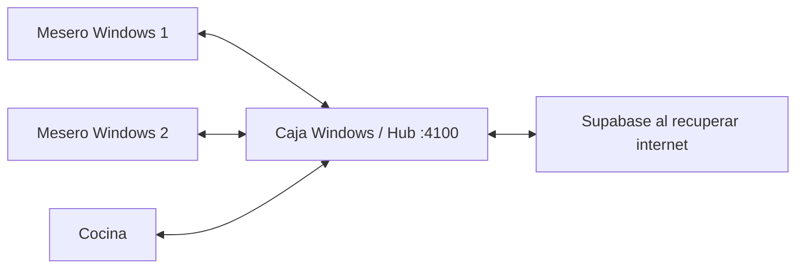

# Intranet Windows: estado y trabajo pendiente

Fecha: 2026-09-28. Configuracion solicitada: caja Windows como Hub y equipos
Windows para meseros. El alcance final incluye operacion y administracion.

## Topologia

El Hub es el punto comun. Los meseros no se replican datos directamente entre
si. Perder internet no equivale a perder la LAN: la caja, el router y los equipos
deben continuar encendidos. El servidor actual vive dentro de MangoPOS; cerrar
la aplicacion de caja tambien lo detiene.

## Implementado en este cambio

- PIN: descarga al entrar al negocio, al cambiar de negocio y cada minuto,
  sin `fn_device_bind`. El RPC nuevo valida sesion y pertenencia al negocio.
- Clientes: consultan primero la caja por LAN. La caja actualiza desde la nube.
  Las solicitudes de PIN se firman, las respuestas se cifran y el token publico
  legacy no sirve para estos endpoints. En disco, cada equipo cifra su copia.
- Multimesero: verifica PIN con el mismo servicio y conserva la configuracion
  local de multimesero y propiedad de mesas durante una caida de WAN.
- Datos de consulta: la caja distribuye catalogo, precios, impuestos,
  modificadores, zonas, geometria de mesas, encabezado de recibo y motivos de
  caja. Las fechas de origen se conservan; una copia vieja no pisa una nueva.
- No se copian colas, borradores, identidades de dispositivo, stock modificado
  localmente ni contadores fiscales mediante ese endpoint de consulta.
- El descubrimiento exige que el Hub corresponda al negocio solicitado.
  Cambiar de negocio reconstruye el controlador de modo de red.
- Instaladores Inno/MSI: regla TCP 4100 para el ejecutable MangoPOS, limitada
  a la subred local y perfiles privado/dominio.

Esto amplifica el Hub existente; **no implementa administracion completa sin
internet**. No se ha desplegado ni validado en los equipos Windows del local.

## Activacion

1. Aplicar `supabase/migrations/20260928_0002_session_offline_roster.sql`.
   Existe su rollback. La migracion se probo en PostgreSQL desechable, no se
   aplico a produccion. Requiere las tablas de empleados y permisos existentes.
2. Verificar las migraciones existentes de `network_mode` y `lan_token`:
   `20260708_0002` y `20260907_0010`. Los endpoints nuevos requieren un token
   privado por negocio; no degradan al secreto compartido de versiones viejas.
3. Actualizar caja y meseros a la misma version. El descubrimiento nuevo exige
   `business_id` en `/hub/health`; un Hub viejo debe actualizarse primero.
4. En Ajustes / Red local, seleccionar politica Hub. En la caja, rol Hub; en
   meseros, rol caja/cliente y la IP estable de la caja. En Windows el servidor
   Dart utiliza 4100 y el agente de impresion utiliza 4000.
5. Mantener el perfil de red privado/dominio. En instalaciones existentes sin
   reinstalar, agregar la regla equivalente TCP 4100 para MangoPOS. No desactivar
   el firewall. Los cambios de instaladores requieren compilacion en Windows.
6. Entrar una vez con una cuenta autorizada en cada equipo para obtener negocio,
   token LAN y sesion. Esto sustituye la vinculacion manual de PIN; no elimina
   la autenticacion inicial ni aprovisiona un equipo nuevo sin credenciales.
7. Esperar a que la preparacion offline y PIN indiquen datos disponibles antes
   de la prueba de desconexion.

Se conserva la caducidad actual de permisos de **24 horas desde la ultima
descarga de nube**. Copiarlos desde el Hub no reinicia ese plazo. Un corte mas
largo requiere definir e implementar una politica de autorizacion local; este
cambio no convierte permisos vencidos en vigentes.

La LAN debe ser de confianza. La proteccion nueva de PIN no cierra los endpoints
legacy del Hub ni sustituye TLS y autenticacion individual de dispositivos para
una red no confiable.

## Administracion completa: cobertura pendiente

| Area | Estado del codigo revisado | Trabajo necesario |
|---|---|---|
| Mesas, pedidos y cocina | Ya hay log, proyecciones y eventos LAN | Validar concurrencia y recuperacion con varias PC reales |
| Inventario | Hay cache y algunas operaciones encolables; CRUD, lotes y transferencias dependen de nube | Estado compartido de stock y transacciones locales por almacen |
| Compras | Escrituras, recepciones y consultas usan Supabase | Guardado local atomico de cabecera/lineas, recepcion y cuentas por pagar |
| Usuarios | PIN existentes se descargan y validan localmente | Altas, bajas, cambios de PIN y permisos con autoridad local y auditoria |
| Configuracion | Se comparte la copia de consulta | Escrituras versionadas locales y resolucion de ediciones simultaneas |
| Integraciones externas | Requieren sus servidores | Diferir envios y mostrar su estado; no simular aprobaciones externas |

## Orden de implementacion del alcance restante

1. **Persistencia administrativa en la caja.** Ampliar la base local transaccional
   con tablas por negocio, versiones de entidades, comandos y resultados.
   Confirmar una operacion solo despues de persistir datos y evento de salida
   juntos. Un reintento con el mismo `operation_id` devuelve el mismo resultado.
2. **Lecturas y escrituras por el Hub.** Adaptar repositorios de inventario,
   compras, empleados y ajustes para usar esa API cuando la politica sea Hub.
   Mientras hay Hub, la caja es la autoridad incluso con internet disponible.
   No basta con reenviar consultas a Supabase desde la caja: fallarian sin WAN.
3. **Inventario y compras.** Aplicar movimientos y recepciones en transacciones
   locales; conservar origen, usuario, almacen y fecha del hecho. Evitar
   reemplazar stock absoluto cuando existen movimientos concurrentes. Una
   recepcion repetida no debe duplicar existencias ni cuentas por pagar.
4. **Identidad local.** Separar el empleado/PIN del inicio de sesion de Supabase.
   El Hub debe poder revocar acceso y validar permisos de cada comando sin
   depender de la sesion amplia de la caja. Crear credenciales de nube e invitar
   por correo siguen siendo tareas diferidas al recuperar internet.
5. **Sincronizacion de servidor.** Agregar deduplicacion transaccional en nube
   por negocio y `operation_id`; registrar errores permanentes y conflictos.
   Cambios en permisos, precios y configuracion necesitan versiones y una
   politica explicita, no una sobrescritura indiscriminada del ultimo equipo.
6. **Operacion Windows.** Evaluar extraer el Hub a un servicio independiente
   de la ventana, respaldo durable y restauracion. El failover existente no
   sustituye una prueba de fallo de disco ni una estrategia contra dos Hubs
   aceptando transacciones simultaneamente.

## Verificacion

- 349 pruebas Flutter de offline, auth, Hub, continuidad de pedidos y UI pasaron.
- Prueba HTTP real en loopback: cliente descarga PIN y datos de consulta;
  rechaza otro negocio, credenciales legacy, permisos vencidos y rol no-Hub.
- `supabase/tests/session_offline_roster_local_test.sh`: verifica migracion
  idempotente, sesion obligatoria, aislamiento, permisos concedidos y baja de
  membresia en PostgreSQL local sin conectarse a produccion.
- Falta ejecutar instaladores y realizar la prueba fisica caja + dos meseros en
  Windows, desconectando WAN pero conservando LAN, reiniciando un cliente y
  verificando pedidos/cobros sin duplicados al reconectar.

Referencia del instalador MSI:
[WiX FirewallException](https://docs.firegiant.com/wix/schema/firewall/firewallexception/).
