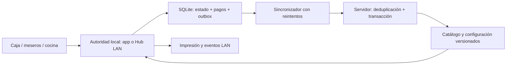

# MangoPOS: diagnóstico de continuidad offline

Fecha: 22 de septiembre de 2026. Código base: `881067cf`.

**Conclusión: existe una implementación offline importante, pero todavía no es seguro prometer que todo seguirá funcionando normalmente al caer internet.** Encontré y reproduje defectos de integridad en la cola y en el replay. La prioridad es corregirlos antes de ampliar funciones o habilitar la emisión fiscal offline.

Este documento conserva el diagnóstico del código base, con referencias de líneas de ese commit. **Actualización posterior al reporte del incidente:** se implementaron correcciones locales y 13 pruebas de regresión; ver [correcciones y pendientes](CORRECCION_INCIDENTE_OFFLINE.md). No se desplegó, activaron flags, aplicaron migraciones ni escribió en Supabase. Los hallazgos de abajo describen la situación original; consultar la actualización para su estado actual.

## Alcance y evidencia

Revisé persistencia, cola, sincronización, Hub LAN, acceso offline, ventas, pagos simples/divididos, caja, cocina, inventario, fiscal, cachés y rutas de otros módulos. Contrasté documentación interna con código actual: los PRD/checklists contienen pendientes que ya se implementaron y comentarios que no coinciden con el comportamiento actual. El código fue la evidencia principal.

Validación realizada:

- Suite completa: **1,561 pruebas aprobadas, 1 omitida, ninguna fallida**. La omitida es una prueba antigua de absorción de centavos, documentada como obsoleta en `test/sales/order_pricing_utils_test.dart:230`.
- Selección inicial de offline, Hub, ventas, caja e impresión: 490 aprobadas, 1 omitida; es un subconjunto de la suite completa, no se suma al total.
- Análisis estático de los archivos seleccionados: 11 observaciones informativas, sin errores ni advertencias de nivel warning. Incluye APIs deprecadas y estilo; no certifica lógica de negocio.
- **Cuatro reproducciones aisladas confirmaron defectos**. Están en [offline_integrity_probe_test.dart](offline_integrity_probe_test.dart). Usan SQLite en memoria y repositorios/HTTP simulados, sin servidor real. Son sondas de auditoría: que pasen significa que reprodujeron el defecto; no son criterios de aceptación ni forman parte de `test/`.

No se verificaron las migraciones efectivamente instaladas en producción, RLS del servidor activo, el negocio/configuración concretos, el navegador desplegado, hardware de impresión ni una LAN con varios equipos. Tampoco se afirma haber revisado cada rama de todos los módulos. Aprobar pruebas existentes no permite afirmar que todas las lógicas estén bien.

## Qué existe y cuánto cubre

| Área | Evidencia actual | Límite relevante |
|---|---|---|
| Detección de caídas | Adaptador + sondeos HTTP, timeouts y avisos de fallo de transporte | Varias rutas siguen intentando nube antes del fallback; disponibilidad de HTTP no equivale a salud de toda la base |
| Acceso | Negocios cacheados, restauración desde caché/roster, PIN bcrypt | Requiere datos previos; el PIN offline vence a las 24 h desde el último roster |
| Catálogo/configuración | Cachés y siembra inicial/periódica de productos, mesas, impuestos, modificadores e impresoras | Debe comprobarse que cada equipo esté preparado; una caché vacía no se reconstruye sin fuente local |
| Ventas | Borradores, snapshots, acciones de ítems y envío a cocina | Cola/replay con defectos reproducidos; falta garantizar paridad de precios y reglas con el servidor |
| Pagos | Encolado, fecha real `paid_at`, recibo provisional y algunos controles contra duplicados | Pagos divididos no conservan el contrato online; crédito bloqueado offline |
| Caja | Apertura local, movimientos y cierre encolables; mapeo de sesiones | Dependencias de pagos/cierre, fechas de movimientos y controles deben endurecerse |
| Inventario | Consulta cacheada, ajustes y movimientos encolables | Fallo de replay reproducido; compras, transferencias y otros procesos no tienen cobertura equivalente |
| Hub | HTTP/WebSocket LAN, op-log SQLite nativo, proyecciones y uplink | Requiere política/roles configurados; no es una autoridad transaccional completa para todas las operaciones |
| Cocina | Proyección del op-log y estados por LAN en `KitchenViewModel` | El guard actual solo habilita la ruta para clientes; el host sigue por nube |
| Impresión | Rutas locales, caché de impresoras y exclusión de áreas ya impresas en replay | Validar impresora desconectada, reinicio, ACK perdido y reimpresión explícita en hardware |
| Fiscal | Allocator, cliente Hub y SQL para conservar NCF offline | `kOfflineNcfEnabled = false`: no se emite NCF offline en el flujo actual |
| Reportes | Snapshots por tipo/rango; algunos indicadores agregan pendientes | No equivalen a un libro local completo actualizado con todas las ventas offline |
| Clientes/compras/otros | CRUD y RPC directos en distintos repositorios | No existe una ruta offline general para todo el sistema |
| Web | Cola y parte del estado en SharedPreferences; arranque web estándar | No tiene la misma persistencia que nativo; arranque offline y recursos deben verificarse por build |

Ejemplos ya resueltos respecto de documentos antiguos: restauración de negocios/sesión desde caché, siembra inicial del coordinador, cifrado de payloads, SQLite para cola/op-log nativos y exclusión de áreas de cocina ya impresas. No conviene rehacerlos: hay que completar sus garantías.

## Hallazgos prioritarios

### P0-1. El sync puede borrar una operación que acaba de aceptarse

**Reproducido.** El sync lee la cola, espera una operación remota y al terminar poda usando esa lista antigua. Mientras espera, otra venta/acción puede encolarse. La poda reemplaza toda la cola y elimina la operación nueva, aunque `enqueueAction` ya devolvió éxito.

Evidencia: `lib/core/offline/offline_pos_service.dart:790`, `:1131`, `:2848`; `lib/core/offline/storage/offline_queue_dao.dart:103`. La transacción SQL hace atómico el reemplazo, pero no protege la lectura anterior frente a otras escrituras.

Corrección: inserciones individuales; poda por IDs/estado efectivamente completados; compactación transaccional limitada a operaciones pendientes identificadas; un único consumidor con adquisición atómica. Ningún reemplazo global desde una copia tomada antes de esperar la red. Cubrir también dos encolados concurrentes.

### P0-2. La huella confunde operaciones diferentes

**Reproducido.** Sincronizar un conteo de inventario de 5 y luego otro de 9 sobre el mismo ítem solo ejecuta el primero; el segundo queda resuelto sin aplicarse.

La huella usa tipo, orden, ítem, producto, cantidad genérica, notas y algunos campos de venta. Omite `counted_quantity`, almacén, sesión de caja, importe, método/check de pago y otros campos específicos. El conjunto de huellas completadas se reutiliza para descartar operaciones futuras. Movimientos de caja y pagos están expuestos al mismo defecto estructural, aunque la reproducción ejecutada usa inventario.

Evidencia: `offline_pos_service.dart:1815` y guard de deduplicación en `:1170`.

Corrección: una intención del usuario recibe un `operation_id` estable; todos sus reintentos conservan ese ID y dos intenciones distintas siempre tienen IDs distintos. Un hash de contenido puede comprobar integridad, pero no debe descartar dos ventas válidas iguales. Añadir deduplicación transaccional en el servidor, no solo en el dispositivo.

### P0-3. Un timeout de inventario durante el replay termina como éxito

**Reproducido con el `InventoryRepository` real y HTTP simulado que siempre lanza timeout.** No llega ningún ajuste al servidor, pero el sync informa `completed = 1`, `failed = 0`, y no queda operación pendiente.

El replay llama a métodos que, ante un error de red, vuelven a encolar y retornan normalmente. El sync interpreta ese retorno como aplicación remota exitosa. La nueva acción termina afectada por la poda de P0-1; incluso reparando la poda, P0-2 puede descartarla por huella.

Evidencia: `lib/data/repositories/inventory_repository.dart:1913`, `:2021`; `offline_pos_service.dart:2075`.

Corrección: separar comandos de usuario de operaciones remotas del replay. El replay no debe reencolar silenciosamente ni ejecutar de nuevo el efecto optimista local. Un resultado explícito distingue «persistido localmente» de «confirmado por servidor».

### P0-4. El replay de pagos divididos no reproduce el cobro original

**Reproducido en la frontera del repositorio.** Una operación con `split_sequence = 1` llega a `processPayment` como `splitSequence = 0`; el cierre toma el default `true`. La sonda también demuestra que un control de cierre presente en el payload es ignorado.

En producción, `payment_split_viewmodel.dart:858` encola secuencia, pero no conserva todos los controles de cierre. El flujo online sí usa `closeOrder`, `closeCheck` y secuencia para distinguir abonos sucesivos. El replay de `offline_pos_service.dart:2559` llama a otro contrato y no los pasa. Esto puede provocar rechazos por cobertura insuficiente, cierre prematuro de check o deduplicación equivocada; el resultado exacto depende del RPC instalado y del tipo de split. La proyección LAN además libera una orden sin check ante cualquier `process_payment` (`hub_order_projector.dart:168`).

Corrección: un único contrato de pago para online/offline; IDs de cada abono, secuencia, saldo y cierre explícitos. Proyectar abonos sin cerrar hasta completar la cobertura. Verificar efectivo+tarjeta, dos abonos del mismo método y varios checks.

### P0-5. Falta idempotencia general del lado servidor para el op-log

**Riesgo confirmado por estructura de código; no se provocaron duplicados en producción.** Hay protección específica para pagos y otras funciones, pero las operaciones de replay no pasan sistemáticamente su `operation_id` al servidor. En `add_item`, por ejemplo, puede aplicarse el RPC y perderse la respuesta antes de guardar mapping/completado; reintentar vuelve a ejecutar la mutación.

El candado del Hub controla quién sube, pero no hace atómicos la mutación remota y su ACK local. Su consulta tampoco lleva un token de época a cada mutación para rechazar escrituras de un antiguo líder que sigue ejecutando.

Evidencia: `offline_pos_service.dart:2152`; `hub/hub_lease_service.dart:111`; `supabase/migrations/20260914_0050_hub_leases.sql:12`.

Corrección: recepción en PostgreSQL con unicidad `(business_id, operation_id)`, verificación de payload, autorización y mutación de negocio en una transacción; devolver el resultado original en reintentos. Donde haya liderazgo, validar su época en cada escritura protegida. Las protecciones específicas existentes se conservan.

### P1-1. El respaldo del Hub tiene huecos verificables

El terminal deja de guardar la operación localmente cuando el Hub devuelve `seq`. Las operaciones del propio host intentan replicarse al backup sin esperar confirmación, pero la ruta HTTP que recibe operaciones de otros terminales solo hace append+broadcast: no llama a esa réplica.

Evidencia: `offline_pos_service.dart:252`, `:285`, `:780`; `lib/core/agent/mobile_print_agent.dart:357`. Además, la promoción protegida actual necesita adquirir la lease en Supabase: no resuelve por sí sola un failover durante una caída total de WAN.

Corrección: retener un registro local hasta ACK durable del destino adecuado, replicar todas las entradas y registrar/reintentar faltantes. Definir el objetivo de pérdida aceptable; para pérdida cero ante la muerte del disco del host, el ACK al usuario necesita persistencia en una segunda copia. Promoción local con exclusión segura del primario; no confundir «no lo veo por red» con «está apagado».

### P1-2. Cocina tiene rutas incoherentes en host y en fallback

`KitchenViewModel._isHubMode` solo acepta `hubClient`, aunque `_fetchHubKitchenItems` contiene una rama `hubHost`. `refresh` y las escrituras están protegidos por ese guard, por lo que el KDS del host continúa intentando Supabase durante una caída.

También `kds_item_status` usa `status` para el estado culinario; el sync de la cola local lo sustituye por `processing`. El replay lee ese mismo campo para actualizar cocina y captura cualquier error como éxito. El camino directo del op-log no pasa por esa sustitución, pero sí conserva el catch amplio.

Evidencia: `lib/presentation/kitchen/viewmodel/kitchen_viewmodel.dart:119`, `:148`, `:268`; `offline_pos_service.dart:1183`, `:2119`.

Corrección: rutas explícitas para host/cliente/aislado, campos distintos `sync_status` y `item_status`, y clasificación de errores que conserve las operaciones no aplicadas.

### P1-3. Persistencia y negocio no se confirman en una sola transacción

La cola nativa usa SQLite, pero snapshots, mappings y otros datos críticos usan SharedPreferences. `StorageService.write` devuelve `false` ante errores y diferentes callers no comprueban el resultado. No hay commit común para cambiar estado de venta, registrar pago, guardar documento y generar la operación de salida. Web usa SharedPreferences también para la cola.

Evidencia: `lib/core/storage/storage_service.dart:87`, `offline_pos_service.dart:471`, `:1546`; `storage/_db_connection_web.dart`.

Corrección: llevar estado transaccional y outbox a una misma base local; confirmar éxito únicamente después del commit. Fallo de disco/clave debe generar recuperación visible, nunca una operación vacía ni un falso «guardado». Migraciones con preservación y respaldo verificado.

La documentación oficial de [SharedPreferences](https://pub.dev/packages/shared_preferences) advierte que no garantiza persistencia en disco al retornar y que no debe usarse para datos críticos. SQLite permite agrupar los cambios con [commit atómico](https://www.sqlite.org/atomiccommit.html); utilizar SQLite para una parte de los datos no hace atómico el flujo entero.

### P1-4. Precio, impuestos, fiscal y dependencias necesitan paridad

- `add_item` se reproduce desde el menú remoto por ID/cantidad, sin pasar un snapshot completo del precio/impuesto cobrado. Cambiar catálogo entre venta y sync puede cambiar el resultado. Los errores al reaplicar modificadores se notifican como conflicto pero no detienen el resto de la venta.
- El loop continúa tras errores de negocio y saltos por backoff; FIFO por sí solo no garantiza «abrir caja → crear ítems → cobrar → cerrar caja». Una dependencia fallida puede dejar avanzar el cierre o el pago.
- El tipo fiscal solicitado viaja en los pagos offline condicionado a disponer de NCF offline. Con el flag apagado, puede perderse la selección y usarse el default remoto.
- `kOfflineNcfEnabled` está desactivado. La caché de un cursor de numeración no garantiza exclusión entre emisor cloud y Hub. Antes de habilitarlo se necesita una estrategia única de asignación/reserva, persistencia y recuperación, además de validar el alcance fiscal con el responsable del negocio.

Evidencia: `offline_pos_service.dart:2152`, `:2197`, `:1160`, `:1280`; `payment_viewmodel.dart:842`; `payment_split_viewmodel.dart:876`; `ncf_offline_allocator.dart:9`.

Corrección: contrato versionado con importes, impuestos, descuentos, unidades, modificadores, actor y fecha originales; validación remota explícita de discrepancias; dependencias por orden/sesión y reconciliación contable. No recalcular silenciosamente una venta ya cobrada. Usar importes decimales exactos o unidades monetarias mínimas con una política de redondeo compartida.

### P1-5. Offline prolongado y «todo el sistema» siguen incompletos

El PIN bloquea al superar 24 h de antigüedad del roster (`offline_auth_service.dart:122`, `:326`); el restore de sesión existente tiene otra política. Hay que decidir duración de contingencia, permisos, revocación y aprobación offline sin simplemente desactivar controles.

El crédito está expresamente deshabilitado offline (`payment_viewmodel.dart:571`). Clientes, compras y varias operaciones administrativas usan nube directamente. Los reportes cacheados solo sirven el rango previamente guardado, no un historial local completo. El umbral de descuadre de caja cae a cero ante error de lectura (`cashier_repository.dart:975`), por lo que ese control puede desaparecer sin conexión.

Corrección: matriz explícita por función y plataforma; libro local para caja/reportes y políticas locales para acciones autorizadas. Identificar separadamente servicios externos que solo pueden quedar pendientes: autorización bancaria, entregas de plataformas externas y comunicaciones con terceros no pueden completarse si no hay ruta hacia ellos.

## Arquitectura recomendada

Continuar sobre las piezas existentes, con **una sola lógica transaccional local**. Para un solo equipo, corre en ese equipo. Para varios dispositivos, la caja/servidor designado actúa como autoridad del local y atiende la LAN tanto con internet como sin él. La nube recibe operaciones y distribuye catálogo/configuración en segundo plano.



La guía oficial de [Flutter sobre offline-first](https://docs.flutter.dev/app-architecture/design-patterns/offline-first) sitúa la coordinación local/remota en repositorios. Aquí conviene sacar decisiones de persistencia y ruteo dispersas en viewmodels y centralizarlas en comandos/repositorios compartidos.

Cada comando debe incluir ID estable, negocio, dispositivo, actor, tipo, versión de esquema, entidad, dependencias y momento real; el payload financiero guarda los valores de la transacción. La base local persiste estado+outbox en el mismo commit. El sync aplica operaciones repetibles, respeta dependencias y conserva conflictos para revisión. ACK significa confirmación durable definida, no simplemente haber iniciado un HTTP.

El modo aislado necesita reglas por recurso: si se pierde también la LAN, dos cajas no pueden asumir propiedad exclusiva de una misma mesa o secuencia. Mantener ventas independientes autorizadas y mostrar claramente qué recursos compartidos necesitan reconciliación.

Para web, definir una certificación separada: almacenamiento transaccional compatible, cuotas/evicción, varias pestañas, recursos/impresoras LAN y arranque sin internet. [Flutter Web FAQ](https://docs.flutter.dev/platform-integration/web/faq) exige configurar el soporte offline/caché adecuado cuando se necesita; `manifest.json` por sí solo no demuestra que el despliegue arranque sin red.

## Orden de ejecución

| Etapa | Entrega concreta | Condición para avanzar |
|---|---|---|
| 1. Integridad P0 | Cola sin reemplazos obsoletos, IDs correctos, replay sin reencolado, pagos divididos completos, deduplicación remota | Las cuatro reproducciones se convierten en regresiones que exigen el comportamiento correcto; fallos después de commit no duplican |
| 2. Modelo transaccional | Estado+outbox durables, contratos versionados, dependencias y paridad de importes | Reiniciar en cada punto del flujo conserva venta y saldo; sin pérdida tras disco lleno o fallo de clave |
| 3. Continuidad operativa | Arranque local, indicador «preparado offline», caja/KDS/reportes locales y ruteo centralizado | Ciclo completo con WAN bloqueada sin esperas repetidas a la nube |
| 4. Multi-equipo | Hub autoritativo, réplica completa, recuperación de clientes y promoción segura | Particiones, ACK perdido, caída/reinicio de host y backup sin duplicados ni doble propiedad |
| 5. Fiscal y cobertura restante | Política fiscal validada, emisión/conciliación y matriz clientes/compras/crédito | Ningún documento duplicado; cada función declara qué puede confirmar y qué queda pendiente |
| 6. Certificación | Ensayo por plataforma y local piloto, observabilidad y procedimiento de recuperación | Evidencias reproducibles de los escenarios siguientes |

Primero integridad; después ampliar cobertura. No asigno un porcentaje de «perfección» ni un plazo sin cerrar alcance por plataforma y verificar el servidor instalado.

## Criterios de aceptación medibles

1. Local previamente preparado: arrancar en frío con WAN bloqueada, entrar con credenciales autorizadas, abrir caja/mesa, agregar/modificar, enviar a cocina, cobrar e imprimir; cerrar caja. Repetir con servidor inaccesible pero Wi-Fi conectado.
2. Ensayo propuesto de 72 h offline, incluyendo reinicios y cambio de empleado. Resolver antes la política actual de roster de 24 h.
3. Cada operación reconocida al usuario sigue en estado local, pendiente recuperable o confirmada remota. Nunca desaparece. Cero duplicados lógicos tras reintentos.
4. Cortar la respuesta justo después del commit remoto; reintentar la misma operación 100 veces: mismo resultado, una sola aplicación.
5. Probar encolados durante sync, acciones simultáneas, pagos parciales/mistos, checks, devoluciones/anulaciones y descuentos. La suma de pagos netos, documentos, caja e inventario coincide antes y después de reconectar.
6. Cambiar precio/impuesto/configuración durante el corte: conservar el valor cobrado y tratar la discrepancia con una regla explícita.
7. Perder WAN, perder solo LAN, apagar Hub, arrancar respaldo y regresar el primario; el sistema no duplica ni permite dos autoridades incompatibles.
8. Impresora sin papel/desconectada, reinicio tras enviar y ACK perdido: estado visible del trabajo y reimpresión identificada. Verificar tickets reales por plataforma.
9. Cola grande, disco lleno, almacenamiento corrupto, clave inaccesible, reloj incorrecto y actualización de esquema: no confirmar falsamente ni borrar pendientes.
10. Objetivos propuestos para medir en hardware piloto: acciones locales habituales p95 < 300 ms, apertura fría preparada < 10 s, sin pausas repetidas por timeouts cloud. Ajustar con carga real.

Registrar pendientes locales/Hub, edad de la más antigua, última confirmación remota, conflictos, salud de respaldo, cachés faltantes y fallos de impresión. Nunca ofrecer «Todo sincronizado» si queda una operación fallida o sin verificar.

## Reproducción

Desde la raíz del repositorio:

```sh
flutter test --no-pub --reporter expanded
flutter test --no-pub --reporter expanded test/core/offline/offline_queue_concurrency_test.dart test/core/offline/offline_replay_integrity_test.dart test/sales/offline_order_continuity_test.dart
dart analyze lib/core/offline lib/core/auth/offline_auth_service.dart lib/core/network lib/presentation/payments/viewmodel/payment_viewmodel.dart lib/presentation/sales/viewmodel/payment_split_viewmodel.dart lib/presentation/cashier/viewmodel/cashier_viewmodel.dart
```

La segunda orden ejecuta ahora las regresiones con invariantes correctos. `offline_integrity_probe_test.dart` es evidencia histórica del commit base: sus expectativas defectuosas dejan de cumplirse con las correcciones. No ejecutarlo como criterio de aceptación ni modificar producción para satisfacerlo.
