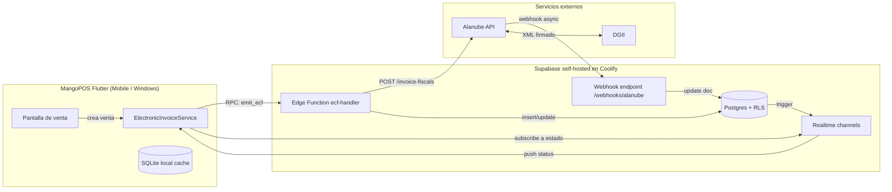
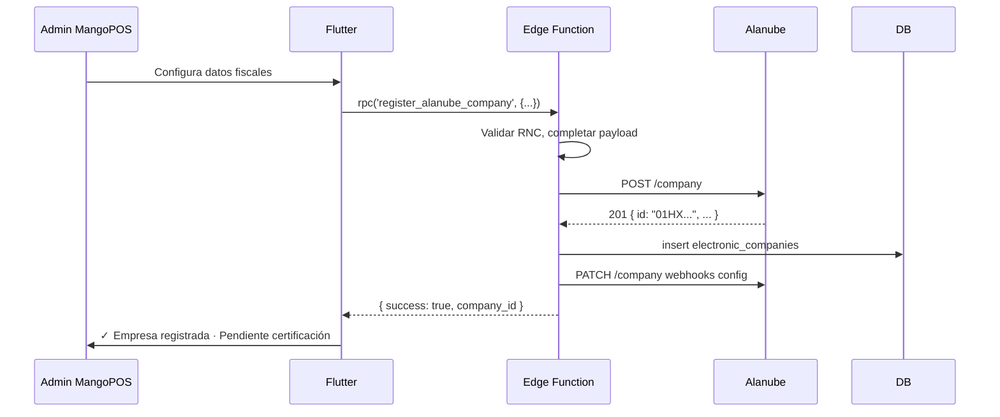
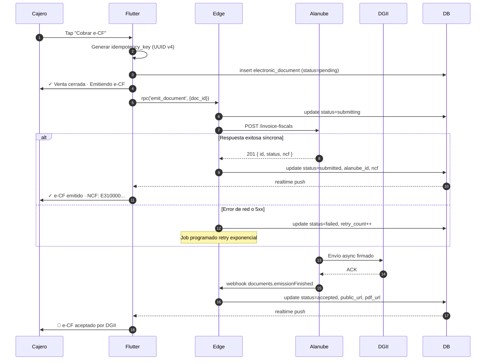
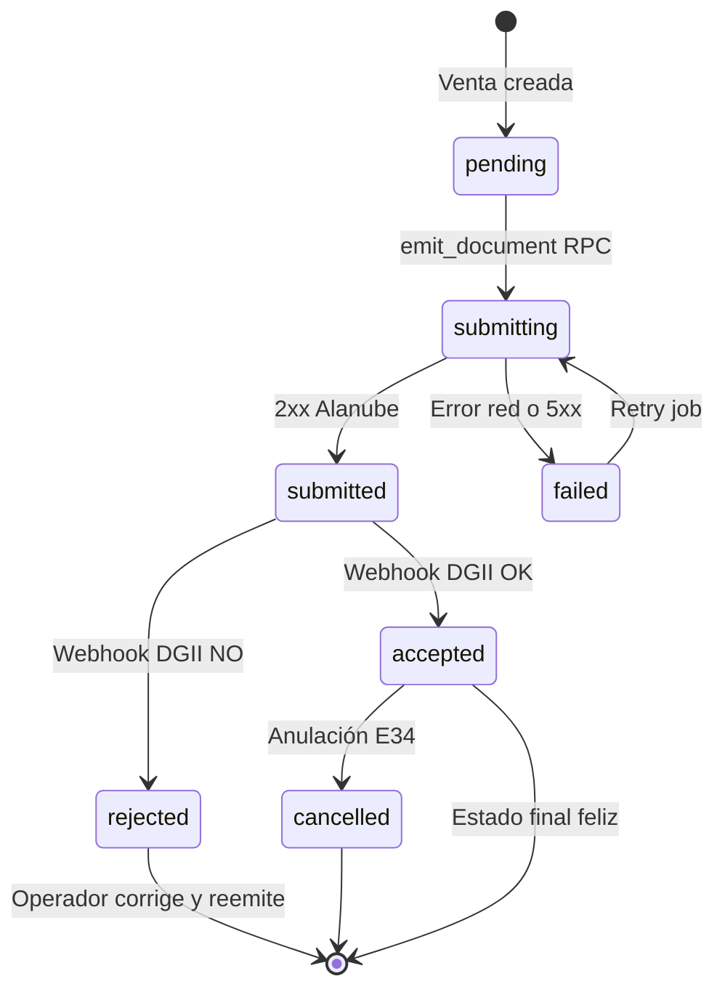
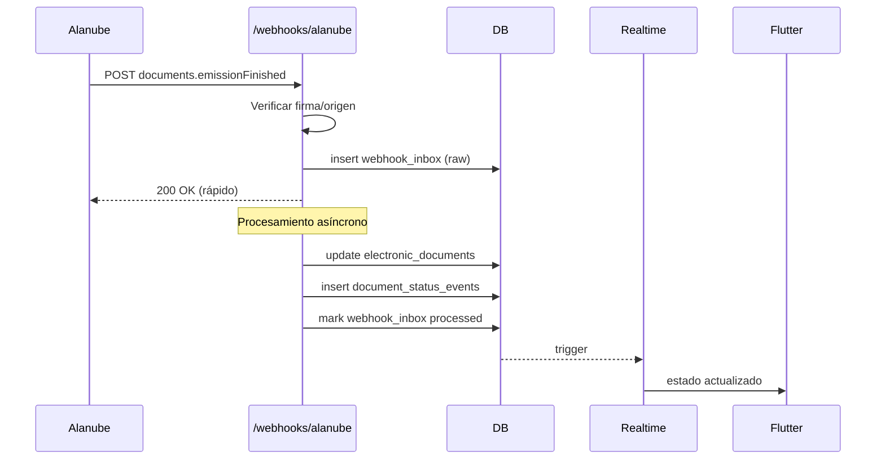

# PRD — Integración de Facturación Electrónica DGII (Alanube) en MangoPOS

| Campo | Valor |
|---|---|
| Versión | 1.0 |
| Fecha | 5 de mayo de 2026 |
| Autor | Cristian / Innovech Software LLC |
| Estado | Draft — listo para revisión técnica |
| Producto | MangoPOS (Flutter mobile + Windows desktop) |
| Backend | Supabase self-hosted (Coolify + Traefik) |
| Proveedor e-CF | Alanube Soluciones SRL |

---

## 1. Resumen ejecutivo

DGII está implementando facturación electrónica obligatoria de forma progresiva en República Dominicana. MangoPOS necesita integrar emisión de e-CF (Comprobantes Fiscales Electrónicos) para que sus clientes finales puedan cumplir con la normativa sin migrar de sistema POS. La integración se hará vía la API REST de Alanube bajo modelo Backend-as-a-Service, evitando construir y certificar un emisor propio (ahorro estimado de 9-12 meses de desarrollo y certificación).

El alcance del MVP cubre los tipos de documento críticos para operación de retail y restaurantes: factura de crédito fiscal (E31), factura de consumo (E32), nota de crédito (E33) y anulaciones. Recepción de documentos de proveedores y respuestas comerciales quedan para fase 2.

## 2. Objetivos y métricas de éxito

### Objetivos de producto

- Permitir a clientes de MangoPOS emitir e-CF directamente desde la pantalla de venta sin cambiar su flujo operativo.
- Centralizar la gestión multi-empresa: un solo Reseller (MangoPOS) administra N clientes con sus respectivas configuraciones DGII.
- Garantizar idempotencia y resiliencia: una venta nunca debe emitir dos e-CF duplicados, y nunca debe quedarse sin emitir indefinidamente.
- Mantener experiencia de cajero fluida: la emisión no debe bloquear el checkout cuando hay problemas de red o con la API.

### Métricas de éxito (90 días post-launch)

| Métrica | Target |
|---|---|
| Tasa de emisión exitosa al primer intento | ≥ 95% |
| Tiempo p95 de emisión sincrónica | ≤ 4 segundos |
| Documentos en estado "pending" >24h | < 0.5% |
| Tasa de rechazo por DGII | < 2% |
| Clientes activos en plan Premium e-CF | 15-20 (primera ola) |
| Tickets de soporte por integración | < 5 por mes después de mes 2 |

### No-objetivos del MVP

- Integración con buzón electrónico para recepción (fase 2).
- Aprobaciones comerciales automáticas de documentos recibidos (fase 2).
- Migración automática de clientes legacy con NCF físicos a e-CF (manual por ahora).
- Soporte para Costa Rica, Panamá, Perú (Alanube los soporta pero MangoPOS no los necesita aún).

## 3. Stakeholders y usuarios

| Rol | Necesidad principal |
|---|---|
| Cajero / Vendedor | Emite venta sin fricción adicional; ve estatus claro de e-CF |
| Dueño/Admin del negocio (cliente final de MangoPOS) | Confianza en cumplimiento DGII; visibilidad de documentos emitidos |
| Contador del cliente | Reportes exportables, descarga de XMLs y PDFs |
| Cristian (Reseller / MangoPOS) | Onboardea clientes nuevos rápido; resuelve incidencias remotamente |
| Alanube | Recibe peticiones bien formadas; recibe acuses de webhooks |
| DGII | Recibe e-CF válidos en formato y plazo |

## 4. Arquitectura técnica

### 4.1 Principio rector: Flutter NUNCA llama a Alanube directamente

Todas las llamadas a Alanube pasan por el backend (Supabase + Edge Function o servicio Dart intermedio). Razones:

- El JWT de Alanube no debe quedar embebido en la app Flutter (riesgo de extracción).
- Centraliza retries, logging, y reconciliación.
- Webhooks de Alanube llegan al backend, no al device.
- Permite cambio de proveedor (Alanube → otro) sin republicar la app.

### 4.2 Diagrama de componentes



### 4.3 Stack y decisiones técnicas

| Decisión | Opción elegida | Alternativa descartada | Razón |
|---|---|---|---|
| Backend intermediario | Supabase Edge Functions (Deno) | Servicio Dart standalone | Ya tienes Supabase corriendo; cero infra adicional |
| Comunicación Flutter↔Backend | Supabase RPC + Realtime | REST tradicional | Realtime resuelve actualizaciones asíncronas nativamente |
| Persistencia de estado de docs | Postgres con RLS por compañía | Solo en Alanube, consultar siempre | Reducir latencia + permitir reportes offline |
| Manejo de webhooks | Endpoint público en Edge Function con verificación de origen | Servicio dedicado | Simplicidad |
| Cache local en Flutter | SQLite con `drift` o `sqflite` | Solo memoria | Permite consulta offline de docs emitidos |

### 4.4 Multi-tenancy

Cada cliente final de MangoPOS es una "Company" en Alanube. El Reseller (MangoPOS) gestiona las companies bajo un solo JWT. La separación se hace por:

- `mangopos_company_id` en Supabase (FK a clientes existentes de MangoPOS)
- `alanube_company_id` (ULID devuelto al crear la compañía en Alanube)
- RLS policies en Postgres que restringen acceso solo a usuarios de esa compañía

## 5. Modelo de datos

### 5.1 Esquema SQL (migration nueva)

```sql
-- Tabla principal: configuración fiscal de cada empresa cliente
CREATE TABLE electronic_companies (
    id UUID PRIMARY KEY DEFAULT gen_random_uuid(),
    mangopos_company_id UUID NOT NULL REFERENCES companies(id) ON DELETE RESTRICT,
    alanube_company_id TEXT UNIQUE NOT NULL,
    rnc TEXT NOT NULL,
    razon_social TEXT NOT NULL,
    nombre_comercial TEXT NOT NULL,
    address TEXT NOT NULL,
    province TEXT NOT NULL,
    municipality TEXT NOT NULL,
    email TEXT,
    environment TEXT NOT NULL CHECK (environment IN ('sandbox', 'production')),
    certification_status TEXT NOT NULL DEFAULT 'pending'
        CHECK (certification_status IN ('pending', 'in_progress', 'certified', 'rejected')),
    logo_uploaded BOOLEAN DEFAULT FALSE,
    webhooks_configured BOOLEAN DEFAULT FALSE,
    created_at TIMESTAMPTZ DEFAULT NOW(),
    updated_at TIMESTAMPTZ DEFAULT NOW(),
    UNIQUE (mangopos_company_id, environment)
);

-- Catálogo de tipos de documento DR
CREATE TABLE document_types (
    code TEXT PRIMARY KEY,
    name TEXT NOT NULL,
    is_async BOOLEAN DEFAULT FALSE,
    description TEXT
);

INSERT INTO document_types VALUES
    ('E31', 'Factura de Crédito Fiscal', FALSE, 'Para B2B con crédito fiscal'),
    ('E32', 'Factura de Consumo', TRUE, 'Para consumidor final, validación asíncrona'),
    ('E33', 'Nota de Débito Electrónica', TRUE, 'Aumenta valor de doc original'),
    ('E34', 'Nota de Crédito Electrónica', TRUE, 'Disminuye o anula doc original'),
    ('E41', 'Compras', FALSE, 'Doc de compras a no inscritos'),
    ('E43', 'Gastos Menores', FALSE, NULL),
    ('E44', 'Régimen Especial', FALSE, NULL),
    ('E45', 'Gubernamental', FALSE, NULL);

-- Documento electrónico emitido (uno por venta, normalmente)
CREATE TABLE electronic_documents (
    id UUID PRIMARY KEY DEFAULT gen_random_uuid(),
    company_id UUID NOT NULL REFERENCES electronic_companies(id),
    sale_id UUID REFERENCES sales(id), -- FK a tabla de ventas existente de MangoPOS
    idempotency_key TEXT NOT NULL, -- generado por Flutter al crear la venta

    document_type TEXT NOT NULL REFERENCES document_types(code),
    ncf TEXT, -- e-NCF asignado por DGII (puede ser null hasta confirmación)

    alanube_document_id TEXT UNIQUE, -- ULID, null hasta que Alanube lo asigne
    dgii_track_id TEXT, -- track id de DGII

    status TEXT NOT NULL DEFAULT 'pending'
        CHECK (status IN (
            'pending',           -- creado localmente, no enviado a Alanube aún
            'submitting',        -- enviando a Alanube
            'submitted',         -- Alanube aceptó, pendiente DGII
            'accepted',          -- DGII aprobó
            'rejected',          -- DGII rechazó
            'cancelled',         -- anulado
            'failed'             -- error de comunicación, retry pendiente
        )),

    -- Datos del documento
    amount_subtotal NUMERIC(15,2) NOT NULL,
    amount_tax NUMERIC(15,2) NOT NULL,
    amount_total NUMERIC(15,2) NOT NULL,
    currency TEXT DEFAULT 'DOP',

    -- Datos del receptor (cliente del cliente)
    customer_rnc TEXT,
    customer_name TEXT,
    customer_email TEXT,

    -- URLs de Alanube (llegan vía webhook o consulta)
    public_url TEXT, -- URL pública DGII para verificación
    xml_url TEXT,
    pdf_url TEXT,

    -- Payloads completos para auditoría
    request_payload JSONB,
    response_payload JSONB,

    -- Metadata operacional
    submitted_at TIMESTAMPTZ,
    accepted_at TIMESTAMPTZ,
    cancelled_at TIMESTAMPTZ,
    cancellation_reason TEXT,
    retry_count INTEGER DEFAULT 0,
    last_error TEXT,

    created_at TIMESTAMPTZ DEFAULT NOW(),
    updated_at TIMESTAMPTZ DEFAULT NOW(),

    UNIQUE (company_id, idempotency_key)
);

CREATE INDEX idx_electronic_documents_status ON electronic_documents(status)
    WHERE status IN ('pending', 'submitting', 'submitted', 'failed');
CREATE INDEX idx_electronic_documents_company ON electronic_documents(company_id, created_at DESC);
CREATE INDEX idx_electronic_documents_sale ON electronic_documents(sale_id);

-- Audit log de transiciones de estado
CREATE TABLE document_status_events (
    id UUID PRIMARY KEY DEFAULT gen_random_uuid(),
    document_id UUID NOT NULL REFERENCES electronic_documents(id),
    previous_status TEXT,
    new_status TEXT NOT NULL,
    source TEXT NOT NULL CHECK (source IN ('api_response', 'webhook', 'manual', 'retry_job')),
    payload JSONB,
    created_at TIMESTAMPTZ DEFAULT NOW()
);

CREATE INDEX idx_status_events_doc ON document_status_events(document_id, created_at DESC);

-- Webhooks recibidos (raw, antes de procesar)
CREATE TABLE webhook_inbox (
    id UUID PRIMARY KEY DEFAULT gen_random_uuid(),
    event_type TEXT NOT NULL,
    payload JSONB NOT NULL,
    headers JSONB,
    processed BOOLEAN DEFAULT FALSE,
    processed_at TIMESTAMPTZ,
    error TEXT,
    received_at TIMESTAMPTZ DEFAULT NOW()
);

CREATE INDEX idx_webhook_inbox_unprocessed ON webhook_inbox(processed, received_at)
    WHERE processed = FALSE;

-- Documentos recibidos de terceros (Phase 2)
CREATE TABLE received_documents (
    id UUID PRIMARY KEY DEFAULT gen_random_uuid(),
    company_id UUID NOT NULL REFERENCES electronic_companies(id),
    alanube_document_id TEXT UNIQUE NOT NULL,
    sender_rnc TEXT NOT NULL,
    sender_name TEXT,
    document_type TEXT,
    ncf TEXT,
    amount_total NUMERIC(15,2),
    commercial_response TEXT
        CHECK (commercial_response IN ('approved', 'partially_approved', 'rejected', 'pending')),
    commercial_response_reason TEXT,
    received_at TIMESTAMPTZ DEFAULT NOW(),
    created_at TIMESTAMPTZ DEFAULT NOW()
);
```

### 5.2 Row Level Security

```sql
ALTER TABLE electronic_companies ENABLE ROW LEVEL SECURITY;
ALTER TABLE electronic_documents ENABLE ROW LEVEL SECURITY;

CREATE POLICY ec_select ON electronic_companies
    FOR SELECT USING (
        mangopos_company_id IN (
            SELECT company_id FROM company_users WHERE user_id = auth.uid()
        )
    );

CREATE POLICY ed_select ON electronic_documents
    FOR SELECT USING (
        company_id IN (
            SELECT id FROM electronic_companies
            WHERE mangopos_company_id IN (
                SELECT company_id FROM company_users WHERE user_id = auth.uid()
            )
        )
    );

-- Inserts solo via Edge Function (service role)
```

## 6. Flujos funcionales

### 6.1 Onboarding de empresa nueva



Pasos manuales tras registro:

1. Subir certificado digital `.p12` a Alanube (vía dashboard de Alanube; no exponer en MangoPOS).
2. Ejecutar proceso de certificación con DGII (asistido por Alanube).
3. Una vez certificado, cambiar `environment` de `sandbox` a `production`.

### 6.2 Emisión de Factura de Crédito Fiscal (E31)

Este es el flujo crítico. Debe ser:

- Idempotente: misma venta = mismo e-CF, nunca duplicar.
- Resiliente: si red falla durante checkout, la venta se completa y la emisión se reintenta.
- No bloqueante: el cajero no espera a DGII.



### 6.3 Estados del documento (state machine)



### 6.4 Webhook handling



**Reglas críticas de webhooks:**

- Responder 200 en menos de 3 segundos siempre. El procesamiento real va a una cola interna (puede ser una segunda Edge Function disparada por trigger en `webhook_inbox`).
- Idempotente: si llega el mismo webhook dos veces, no causa efectos duplicados.
- Si el webhook llega antes que la respuesta sincrónica del POST original (race condition), aplicar el estado más avanzado (eventualmente consistente).

## 7. API contracts

### 7.1 Flutter → Supabase RPC

#### `emit_document(doc_id UUID) → JSON`

Envía a Alanube un documento previamente creado en estado `pending`.

```json
// Request (vía supabase.rpc)
{
  "doc_id": "550e8400-e29b-41d4-a716-446655440000"
}

// Response success
{
  "success": true,
  "document": {
    "id": "550e8400-...",
    "status": "submitted",
    "ncf": "E310000000001",
    "alanube_id": "01HX...",
    "submitted_at": "2026-05-05T15:30:00Z"
  }
}

// Response failure (no throws, devuelve estructura)
{
  "success": false,
  "error_code": "ALANUBE_VALIDATION",
  "error_message": "RNC del receptor no válido",
  "retry_recommended": false
}
```

#### `cancel_document(doc_id UUID, reason TEXT) → JSON`

Genera una nota de crédito (E34) que anula el documento original.

#### `register_alanube_company(payload JSON) → JSON`

Registra una empresa nueva en Alanube y persiste en `electronic_companies`.

### 7.2 Edge Function → Alanube

Todas las llamadas usan:

```
Authorization: Bearer ${ALANUBE_JWT}
Content-Type: application/json
Base URL: https://sandbox.alanube.co/dom/v1   (o api.alanube.co en prod)
```

#### POST `/invoice-fiscals` (E31)

Payload mínimo (esquema simplificado, validar contra OpenAPI de Alanube):

```typescript
interface E31Payload {
  documentNumber: number;          // secuencial interno
  encf: string;                    // e-NCF asignado
  sender: { rnc: string };
  receiver: {
    rnc: string;
    name: string;
    email?: string;
  };
  items: Array<{
    code?: string;
    description: string;
    quantity: number;
    unitPrice: number;
    discount?: number;
    taxes: Array<{
      code: string;                // "ITBIS"
      rate: number;                // 0.18
      amount: number;
    }>;
  }>;
  totals: {
    subtotal: number;
    totalTaxes: number;
    total: number;
  };
  date: string;                    // ISO 8601
  paymentMethod: number;
  paymentTerm?: { ... };
}
```

### 7.3 Webhook receiver

Endpoint: `POST /webhooks/alanube` (Edge Function pública)

Headers esperados:
- `X-Alanube-Signature`: HMAC para verificación

Cuerpos por tipo de evento:

```json
// documents.emissionFinished
{
  "event": "documents.emissionFinished",
  "data": {
    "documentId": "01HX...",
    "status": "accepted",
    "ncf": "E310000000001",
    "publicUrl": "https://...",
    "pdfUrl": "https://...",
    "xmlUrl": "https://...",
    "dgiiTrackId": "...",
    "timestamp": "2026-05-05T15:30:05Z"
  }
}
```

## 8. Manejo de errores y resiliencia

### 8.1 Categorías de errores

| Categoría | Acción | Notificar a usuario |
|---|---|---|
| 4xx validación (RNC inválido, schema mal formado) | No retry, marcar `failed`, mostrar error específico | Sí, con detalle |
| 401/403 auth | Alertar a admin, retry tras refresh JWT | Sí, genérico |
| 429 rate limit | Retry con backoff exponencial | No (transparente) |
| 5xx Alanube | Retry exponencial 3 veces, luego notificar | Solo si excede 3 intentos |
| Network timeout | Retry inmediato 1 vez, luego encolar | No (transparente) |
| Webhook llega sin doc previo | Crear doc orfano, alertar para investigación | No al cajero, sí a admin |

### 8.2 Job de retry

Edge Function programada (cron) que cada 5 minutos:

1. Busca documentos en estado `failed` o `submitting` con `last_attempt > 5min`
2. Reintenta hasta `retry_count = 5`
3. Después de 5 intentos, mueve a `failed_permanent` y dispara alerta

### 8.3 Reconciliación diaria

Job nocturno que:

1. Lista todos los documentos en estado terminal de los últimos 7 días en MangoPOS
2. Consulta a Alanube via `GET /invoice-fiscals/{id}` para los últimos casos
3. Detecta drift entre nuestro estado y el de Alanube
4. Corrige y notifica si hay discrepancias

### 8.4 Modo offline (Flutter)

- Permitir cerrar venta aunque no haya conectividad.
- Documento se queda en `pending` localmente (SQLite).
- Al recuperar conexión, sync push intenta emitir.
- Si se acumulan más de N documentos pendientes, mostrar warning visible al cajero.
- DGII permite emisión hasta X horas después del hecho generador; respetar ese plazo.

## 9. Cambios de UI/UX en Flutter

### 9.1 Pantalla de venta

Cambios mínimos:

- Botón de cobrar muestra dos opciones cuando aplique: "Cobrar (consumo)" → E32 / "Cobrar (con NCF)" → E31.
- Si el cliente está obligado a e-CF, no hay opción "sin NCF".
- Después del cobro, banner inferior con estado: 🔄 Emitiendo... → ✓ Emitido NCF: E310... → 📩 Aceptado DGII.

### 9.2 Pantalla nueva: Documentos electrónicos

Lista filtrable de documentos emitidos con:

- Filtros: estado, tipo de documento, fecha, RNC del receptor, ID de venta.
- Acciones por fila: ver PDF, ver XML, ver URL pública DGII, anular (genera E34).
- Indicador visible de docs en estado problemático (pendientes >24h, fallidos).

### 9.3 Pantalla nueva: Configuración fiscal

- Datos de la empresa (RNC, razón social, etc.).
- Estado de certificación con DGII.
- Selector sandbox/producción (oculto para usuarios no-admin).
- Logo para PDFs (upload base64).
- Configuración de webhooks (URL, secret).

### 9.4 Notificaciones push

- Documento rechazado por DGII → push al admin con razón.
- Documentos pendientes de retry > 1h → push.
- Webhook nunca recibido en plazo esperado (>30min) → alerta al admin.

## 10. Seguridad

### 10.1 Manejo de credenciales

| Credencial | Dónde vive | Rotación |
|---|---|---|
| JWT de Alanube (Reseller) | Vault de Coolify, inyectado a Edge Function | Manual cuando Alanube lo emita |
| Webhook secret | Variable de entorno Edge Function | Anual o ante incidente |
| Service role key Supabase | Variable de entorno Edge Function | Cada 90 días |
| Anon key Supabase | Embebida en Flutter | Pública por diseño, RLS protege datos |

JWT de Alanube **nunca** se envía a Flutter. Las llamadas Flutter→Supabase usan auth Supabase normal; Edge Function añade el JWT de Alanube server-side.

### 10.2 Verificación de webhooks

- Validar header `X-Alanube-Signature` contra HMAC SHA-256 del payload con `webhook_secret`.
- Rechazar payloads con timestamp >5 minutos en el pasado/futuro (anti-replay).
- Whitelist de IPs de Alanube si publican rango.

### 10.3 RLS y aislamiento entre empresas

Validar que la consulta `SELECT * FROM electronic_documents WHERE company_id = X` desde un usuario de empresa Y devuelva 0 filas. Test automatizado obligatorio.

### 10.4 Auditoría

`document_status_events` registra toda transición con timestamp + source. No se borra nunca. Permite responder a DGII si auditan.

## 11. Roadmap de implementación

### Fase 1 — MVP (5-6 semanas)

| Semana | Hito |
|---|---|
| 1 | Esquema SQL + RLS + migrations · Setup Edge Functions · Auth con Alanube sandbox |
| 2 | Endpoint `register_alanube_company` · Onboarding manual primer cliente piloto |
| 3 | Endpoint `emit_document` para E31 · UI emisión en pantalla venta |
| 4 | Webhook receiver + procesamiento async · Realtime push a Flutter |
| 5 | Pantalla "Documentos electrónicos" + acciones (PDF/XML/URL) · Manejo de errores |
| 6 | Testing E2E con cliente piloto en sandbox · Ajustes · Deploy producción |

### Fase 2 — Cobertura completa (3-4 semanas)

- E32 (Factura de consumo) con flujo asíncrono
- E33/E34 (Notas de crédito/débito)
- Anulación de documentos
- Job de retry y reconciliación diaria
- Onboarding de 5-10 clientes adicionales

### Fase 3 — Recepción (3-4 semanas)

- Endpoint para recibir documentos de proveedores
- UI buzón electrónico
- Aprobación comercial de documentos recibidos
- Reportes mensuales para contadores

### Fase 4 — Optimización (continua)

- Migración masiva de clientes legacy
- Dashboard de salud DGII por empresa
- Plantillas pre-llenadas según tipo de cliente
- Integración bidireccional con módulo contable (futuro)

## 12. Riesgos y mitigaciones

| Riesgo | Probabilidad | Impacto | Mitigación |
|---|---|---|---|
| Alanube cambia esquema de API rompiendo integración | Media | Alto | Tests de contrato; suscripción a changelog; versión pinneada en Edge Function |
| Webhook nunca llega para un documento | Media | Medio | Job de polling cada hora para docs en `submitted` >2h |
| DGII rechaza documentos por error de configuración del cliente | Alta inicialmente | Medio | Validaciones pre-emisión exhaustivas; capacitación a clientes |
| Race condition: webhook llega antes que respuesta síncrona | Media | Bajo | Lógica idempotente en handler; estado siempre avanza, nunca retrocede |
| Flutter offline durante venta crítica | Alta | Alto | Modo offline con cola; alertas claras al operador |
| Cliente final cambia su RNC o datos fiscales | Baja | Alto | UI para actualizar config; revalidar antes de cada emisión si hay cambios |
| Pérdida de JWT de Alanube | Baja | Crítico | Vault con backup; runbook de rotación de emergencia |
| Volumen excede tier 1 de Alanube y dispara facturación inesperada | Media | Medio | Dashboard de consumo; alertas a 75% del tier; refacturación automática a clientes |

## 13. Anexos

### A. Tipos de documento DR (resumen)

| Código | Nombre | Caso de uso típico |
|---|---|---|
| E31 | Factura de Crédito Fiscal | Venta B2B con derecho a crédito ITBIS |
| E32 | Factura de Consumo | Venta a consumidor final |
| E33 | Nota de Débito | Aumento al valor de un documento previo |
| E34 | Nota de Crédito | Anulación o reducción de documento previo |
| E41 | Compras | Compras a no inscritos |
| E43 | Gastos Menores | Gastos sin proveedor formal |
| E44 | Régimen Especial | Sectores específicos |
| E45 | Gubernamental | Operaciones con gobierno |

### B. Glosario

- **e-CF**: Comprobante Fiscal Electrónico
- **e-NCF**: Número de Comprobante Fiscal Electrónico
- **DGII**: Dirección General de Impuestos Internos
- **RNC**: Registro Nacional del Contribuyente
- **ULID**: Universally Unique Lexicographically Sortable Identifier (formato de IDs de Alanube)
- **Hecho generador**: Momento de la transacción que da origen al doc fiscal
- **Track ID**: Identificador asignado por DGII al recibir un documento

### C. Referencias

- Alanube docs: https://developer.alanube.co/docs/getting-started
- Alanube changelog: https://developer.alanube.co/changelog
- DGII normativa e-CF: portal de DGII (consultar versión vigente)
- Norma General 01-2020 (DGII): regulación e-CF

### D. Decisiones pendientes (a resolver antes de iniciar dev)

- [ ] ¿Edge Functions en self-hosted Supabase están disponibles en tu instalación de Coolify? Si no, alternativa: servicio Dart deployado como contenedor Coolify aparte.
- [ ] ¿Mantener sales table actual y referenciar desde electronic_documents, o crear tabla intermedia?
- [ ] ¿El webhook secret se gestiona por empresa o uno solo del Reseller? (Alanube sugiere por empresa).
- [ ] ¿Qué hacer con NCFs físicos legacy en migración? (Probable: marcar todas las ventas previas como "manual_ncf" y arrancar e-CF en cero).
- [ ] ¿Notificación al cliente final por correo cuando se emite e-CF? (Alanube ofrece `notificationByEmail`; podemos delegarlo o hacerlo nosotros).
- [ ] Definir SLA interno: tiempo máximo entre venta y emisión exitosa. Sugerencia: 99% en <60 segundos.

---

**Próximos pasos sugeridos:**

1. Revisar este PRD y marcar decisiones pendientes (sección D).
2. Solicitar JWT de sandbox a Alanube (tel +1 829 956 0059 o calendly).
3. Crear repositorio o branch para integración (`feature/ecf-integration`).
4. Programar primer hito: SQL migrations + Edge Function de health check contra Alanube sandbox.
